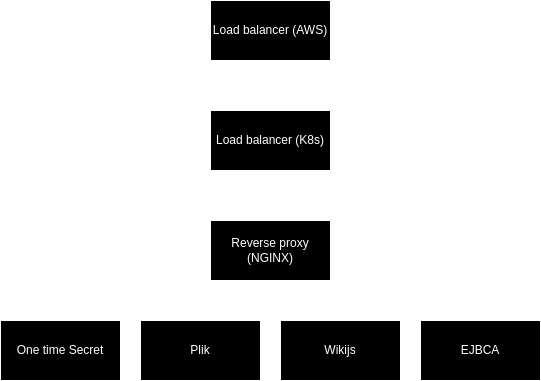

# Kubernetes Testing

This project was created with the objective of learning K8s basics and concepts.

## Components

- **Load Balancer (AWS)**
    - Distributes incoming traffic across multiple servers
    - Ensures high availability and performance
- **Reverse Proxy (NGINX)**
    - Acts as an intermediary between clients and backend servers
    - Provides caching, SSL termination, and load balancing
- **Backend Services**
    - [One-time Secret](https://github.com/onetimesecret/onetimesecret)
    - [Plik](https://github.com/root-gg/plik)
    - [Wiki.js](https://github.com/requarks/wiki)
    - [EJBCA](https://github.com/Keyfactor/ejbca-ce)

## Diagram

---

---

## Requirements

- Kubernetes infrastructure, either [on-premises](https://github.com/jdmedeiros/k8s/tree/original_v126_update) or cloud
- Network Load balancer
- Domain Name (Dynamic DNS works)
- SSL Certificate (optional)

## Getting started

1. Clone the project.
2. Navigate to the /setup directory within the project.
3. For each folder inside /setup, do the following, in folder name order:
   * **Read**: Open the README.md file in the folder and carefully follow any instructions or configuration steps it provides. 
   * **Modify (if necessary)**: If the README.md file asks you to change any parameters or settings, edit the run.sh script in the same folder accordingly.
   * **Execute**: Run the run.sh script. **(permissions may be needed `chmod 700 run.sh`)**
4. Troubleshooting: If you encounter errors while running a script, consult the README.md file for that folder for troubleshooting tips.

